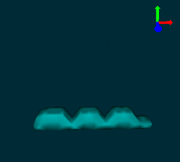
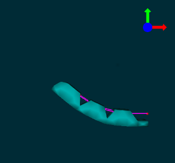
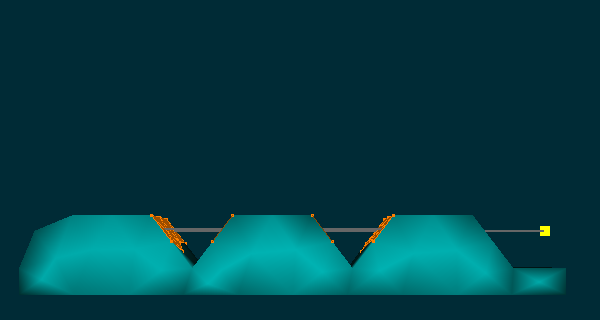
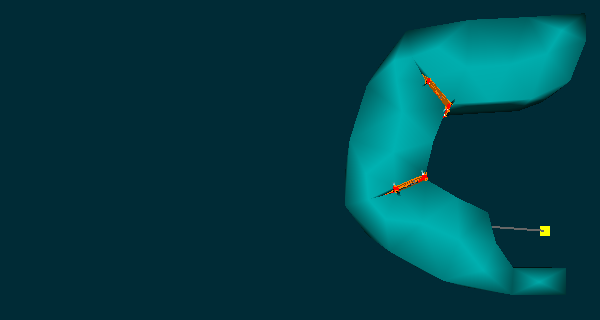
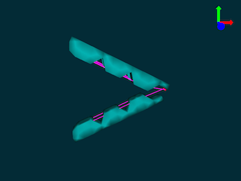
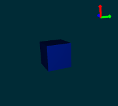

{width=100%}

## Simulating a cable based soft gripper
This tutorial describes how to set-up a simulation environment, a scene, using Sofa and how to use SoftRobots
plug-in to model a virtual soft gripper driven by cables. Once modeled the robot can be simulated. To
control our simulated robot dedicated controller can be writen using the Python langage. In this tutorial
we implements keyboard base control.

### Step 0: Try the simulation in Sofa
Before continuing this tutorial it may be a good idea to try the resulting simulation you need to achieved.
You can do that by clicking on the [Animate](sofa?action=animate) button in Sofa. When the simulation is
running you can manipulate the gripper by pressing the following keys:

- ctrl + to close the gripper
- ctrl - to open the gripper
- ctrl *arrow up* to move it up
- ctrl *arrow down* to move it down
- ctrl *arrow left* to move it left
- ctrl *arrow right* to move it right

Note that with MacOS, you may have to use *cmd* instead of *ctrl*.

### Step 1: Scene setup
In this step we will explain how to setup a basic scene in Sofa.


<script type="text/javascript" language="JavaScript">
function HideContent(d) {
document.getElementById(d).style.display = "none";
}
function ShowContent(d) {
document.getElementById(d).style.display = "block";
}
function ReverseDisplay(d) {
if(document.getElementById(d).style.display == "none") { document.getElementById(d).style.display = "block"; }
else { document.getElementById(d).style.display = "none"; }
}

  function show(id) {
    document.getElementById(id).style.visibility = "visible";
  }
  function hide(id) {
    document.getElementById(id).style.visibility = "hidden";
  }

</script>


<a href="javascript:ReverseDisplay('uniquename')">
Click to show/hide.
</a>

You first need to create a file named *mycablegripper.pyscn*.
This file should contains the following lines:


<div id="sofacode" onMouseOver="show('sofabar')" onMouseOut="hide('sofabar')">
<div id="sofabar">Div 1 Content </div>
<div id="uniquename" style="display:block;">
```python
import Sofa

def createScene(rootNode):
    rootNode.createObject('RequiredPlugin', pluginName='SoftRobots')
    rootNode.createObject('VisualStyle', displayFlags='showVisualModels showBehaviorModels')
    rootNode.createObject('BackgroundSetting', color='0 0.168627 0.211765')
    rootNode.createObject('OglSceneFrame', style="Arrows", alignment="TopRight")
```
</div>

</div>

The content of a *pyscn* file is standard python code that must define a function called *createScene*.
This *createScene* function is mandatory as it is the one called automatically by Sofa when the file is loaded.
This function is in charge of filling the simulation's content, in this case by adding three objects
to the root node of the simulation.

The first one, *RequiredPlugin* tells Sofa that this scene required the SoftRobots plugins to run properly.

The second one adds a component that describes what data needs to be displayed using `show` / `hide` keywords. Each of the `displayFlags` is associated
to a check-box in the Visualization Panel of Sofa. In this example, we only want to display the appearance of the robot (`VisualModel`)
and the volumetric mesh that we will generate (`BehaviorModel`). The `BehaviorModel` is only used for debug purpose and will not be displayed
in the final version of the simulation.

The third one adds a component that describes specify the background color or image of the simulation of the 3D view.

The fourth one adds a rigid frame system in the 3D view. This one is very useful to help the developer understand how the different
objects are located in the 3D space.

### Step 2: Modeling and simulating deformations

[Open Step 2 in Sofa](step2-ModelingAndSimulatingDeformations/02-SimulatingDeformations.pyscn)

The second step of this tutorial is to allow the finger to be mechanically simulated. This implies to:

- Provide a solving method
- volumetric mesh and mass properties to compute deformations and energy</LI>
- mechanical model of the deformation
- An attach point

Additionnaly, a visual model has been added, with a mapping between the tetrahedron model and the stl-geometry to provide visualization of the deformations produced



After clicking on "Animate" you can select the finger (shift + click left) and move it around.

## Step 3: Actuating the finger with a cable

[Open Step 3 in Sofa](step3-ActuatingTheRobotWithCable/03-FingerActuation.pyscn)

In the previous step, we showed how to model and simulate a soft robot with a finger shape and made of a deformable material (silicone rubber). In this step, we will explain how to actuate it using a 1d inelastic cable attached to the fingertip. The cable can be used to pull or release the fingertip by pressing ctrl+ and ctrl-.

This scene adds the following functionalities:
- Create a cable actuator based in constraints
- Include a mechanical mapping to link the cable motion to the object deformation
- Use a Python script to drive the cable
- Actuate it interactively



## Step 4: Defining self-collision regions

[Open Step 4 in Sofa](step4-DefiningSelfCollisionRegions/04-CollisionRegions.pyscn)

By default Sofa doesn't handle self-collisions, which in general are expensive to compute. This can lead to some undesireable results, i.e. self-interesections, as seen in the figure below

{width=300}

Therefore, it is possible to define special geometries for which collions are checked and handled. In the following figure, the collision regions are shown in orange.
{width=300}

Self-intersection is prevented by the collision regions as shown in this figure.
{width=300}

## Step 5: Soft gripper robot
[Open Step 5 in Sofa](step5-MultiFingerGripper/05-Gripper.pyscn)

In the previous steps, we showed the simulation of a single finger made of elastic material. But the orginal soft gripper robot is composed of three fingers actuated with cables. In the design of Taimoor Hassan et al., a single cable is used for the three fingers. We simulate that by applying the same control input to three cable actuators placed on the three fingers.

In the file scene, we put 3 finger models (instead of 1) by copy/paste of the previous simulations.A 'PythonScriptController' is placed at the root node of the graph to interactively change the inputs of 3 the 'CableConstraint'  components. Here, we use a control of the actuator, i.e. direct or fowrward simulation.



### How to use the demo

After clicking on "Animate" you can click in the 3d view then pulling/releasing the three cables by pressing CTRL+  and CTLR-.


## Step 5: Grasping simulation

[Open Step 6 in Sofa](06-GraspingSimulation.pyscn)


The simulation in SOFA allows to reproduce grasping using a combination of constraints for frictional contact (using Coulomb's friction) and for actuators. To do this, we need to modify several elements of the simulation.

### A. Activate collision and direct simulation

In this exemple, we will simulate the collision response of the gripper with its environment and particularly an object that will be grasped. The first step is to activate the modules for collision detection and response in SOFA. This modules are described in more details in the documentation of SOFA. The user can modify the coefficient of friction in RuleBasedContactManager (mu=0.8). GenericConstraintSolver is able to solve, in a unified system, the constraints         for collision response and the constraints (direct, non inverse) of the actuators.

### B. Add an object that will be grasped



We add a rigid object, and simulate its dynamics with a 6Dof mechanical object. It computes the physics at the center of gravity. The mass and inertia of the object are computed by UniformMass. The component UncoupledConstraintCorrection provides the physics-based response after collision (in practice, it will use the parameters of the component UniformMass).
Then, we will need to add a collision model to detect the contact between this cube and the soft gripper. First, we load the mesh that is used for collision and create a mechanical object with it. Then, we add the collision primitive (Triangle, Line and Point) that will be tested. Finally, the collision model is linked to the behavior of the center of gravity by a RigidMapping.


In the same way, we can load an other mesh and use a mapping for the visualization.

### C. Add a fixed floor

Now, we add a collision surface collision plane so that we can place the object before and after grasping:


### D. Add collision models to the gripper


We need to put a collision surface to each finger of the soft gripper. In the graph, the collision model is a child of the node that contains the mechanical object (here, the FEM model of each finger). This surface is defined by a mesh (here finger.stl). The primitive of collision are also defined (Triangle, Line, Point). The surface motion is linked to the motion of the FEM model using a BarycentricMapping:


### E. Control the gripper

The user can interactively control the gripper using keyboard events. The definition of the controls is done using a python script. To close/open the gripper, press the following keys:

- ctrl + '+'
- ctrl + '-'

Note that with MacOS, you may have to use *cmd* instead of *ctrl*. The actuator are controlled in force. They key ctrl + increased the force applied on the cable. To move the gripper, press the following keys:


### Volumetric Mesh Generation

Volumetric mesh generation is a complex topic and several tools exists to perform this task such as: [GID](http://www.gidhome.com/), [CGAL](http://www.cgal.org/) or [Gmsh](http://geuz.org/gmsh/). We choose to use the C++ library `CGAL` ([CGAL](http://www.cgal.org)) as a dedicated plug-in for Sofa exists. Volumetric mesh can be computed either using a surface mesh or an image. Whatever the input, we need to add the `CGALPlugin` with the following line:

~~~
rootNode.createObject('RequiredPlugin', pluginName='CGALPlugin')
~~~

All the components that will help to build the volumetric mesh will be placed in a child node, this is performed with

~~~
node = rootNode.createChild('node')
~~~

Then, we need to load the surface mesh that will be used as input for CGAL. Many file formats are supported (`OBJ`, `VTK`, `STL`...). In our example, a STL file has been produced using some CAD software. This file is then loaded with:

~~~
node.createObject('MeshSTLLoader', name='mesh', filename=path+'finger.stl')
~~~

And then the magic is performed with the `MeshGenerationFromPolyhedron` where four parameters are used to control the meshing:

- `cellSize`: this parameter controls the size of mesh tetrahedra. It provides an upper bound on the circumradius of the mesh tetrahedra
- `facetAngle`: This parameter controls the shape of surface facets. Actually, it is a lower bound for the angle (in degree) of surface facets. When boundary surfaces are smooth, the termination of the meshing process is guaranteed if the angular bound is at most 30 degrees
- `facetAngle`: this parameter controls the shape of surface facets. Actually, it is a lower bound for the angle (in degree) of surface facets. When boundary surfaces are smooth, the termination of the meshing process is guaranteed if the angular bound is at most 30 degrees
- `cellRatio`: this parameter controls the shape of mesh cells. Actually, it is an upper bound for the ratio between the circumradius of a mesh tetrahedron and its shortest edge. There is a theoretical bound for this parameter: the Delaunay refinement process is guaranteed to terminate for values larger than 2
- `facetApproximation`: the approximation error between the boundary and the subdivision surface. It provides an upper bound for the distance between the circumcenter of a surface facet and the center of a surface Delaunay ball of this facet

It may require some trials and errors to find a good set of parameters that capture well the details of the surface mesh without leading to a large number of tetrahedra. The framerate of the simulation is quite sensitive to the setting of these parameters. If the simulation is running to slow consider changing them in order to reduce the number of tetrahedra. For our example, the set of parameters is:

~~~
node.createObject('MeshGenerationFromPolyhedron', name='gen', template='Vec3d', inputPoints='@mesh.position', inputTriangles='@mesh.triangles', drawTetras='1',
    cellSize="10",
    facetAngle="30",
    facetSize="4",
    cellRatio="2",   #Convergence problem if lower than 2
    facetApproximation="1"
    )
~~~

The computed tetrahedra are then stored in a mesh container for later usage with:

~~~
node.createObject('Mesh', position='@gen.outputPoints', tetrahedra='@gen.outputTetras')
~~~

Mind the fact that the syntax used links the output of the generator 'gen' to the created 'Mesh' object using '@'. After that you may export the resulting volumetric mesh with the following line for further use:

~~~
node.createObject('VTKExporter', filename=path+'finger', edges='0', tetras='1', exportAtBegin='1')
~~~

We want to export only the tetrahedra (no edges, no triangles) and we want a single export that is performed at the beginning of the simulation (a single export is needed since the mesh will not deform during this simulation).

For an interactive feedback of what has been computed by `CGAL`, we can use this line:

~~~
node.createObject('OglModel', filename=path+"finger.stl", color="0.0 0.7 0.7 0.5")
~~~

It will superimpose the surface mesh on the volumetric mesh.


